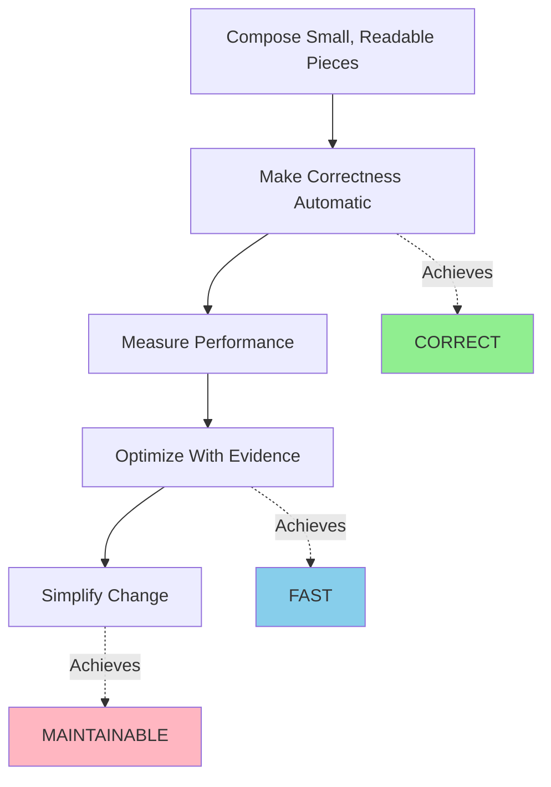

# Manoj Malviya

**Senior Software Engineer** | Building systems that are correct, fast, and maintainable

[](mailto:malviyamanoj1896@gmail.com)
[](https://github.com/manojmalviya)
[](https://linkedin.com/in/manojmalviya)
[](https://scholar.google.com/citations?user=yourID)
[](https://manojmalviya.com)

📍 Berlin, Germany

---

## Table of Contents

- [Who Am I](#who-am-i)
- [How I Work](#how-i-work)
- [Current Work](#current-work)
- [Past Work](#past-work)
- [Tech Stack](#tech-stack)
- [Selected Projects](#selected-projects)
- [Achievements](#achievements)
- [Technical Writing](#technical-writing)
- [Education](#education)
- [Impact & Contributions](#impact--contributions)

---

## Who Am I

Senior Software Engineer with 7+ years building high-performance systems across desktop, embedded, and web platforms. I specialize in taking complex problems and delivering solutions that are both technically excellent and user-friendly.

**Core Expertise**:
- High-performance systems (C++, Python, Swift)
- Computational design and optimization algorithms
- Cross-platform desktop applications (Qt/QML)
- Full-stack development (TypeScript/React)
- Hardware-software integration

**What I Deliver**:
- ⚡ Performance: 150x speed improvements, 60% latency reductions
- 🎯 Reliability: Type-safe systems with observable failures
- 🚀 Impact: 20% cost reduction, 15% NPS improvement, millions of users served
- 👨‍🏫 Leadership: Mentoring, setting standards, driving technical excellence

---

## How I Work

### Code Philosophy

I build software using these principles:


[](./learn/philosophy.md)

**Soft Skills**:
- **Collaboration**: Bridge Product, Design, and Engineering teams for user-centric solutions
- **Learning**: Fast adopter of new tech stacks (Swift, Go, Rust) driven by problem requirements
- **Discipline**: Set and maintain development standards, mentor juniors in clean-code practices
- **Creativity**: Novel algorithms for 3D printing, optimization, and computational design

---

## Work Experience

<details>

<summary><strong>Senior Software Engineer Tech Lead</strong>
Flowkey GmbH
*Mar 2025 – Present | Berlin*</summary>
### Senior Software Engineer Tech Lead @ 

Leading core technologies for a music learning app. Focus: clean UI/UX and high-performance systems.

**Tech Stack**: C++ · Qt/QML · Swift · Python · TypeScript · GraphQL · MongoDB · AWS Lambda · GitHub Actions

**Key Contributions**:

**150x Performance Improvement**
- Reduced sheet music rendering from 30s → 200ms
- Architected C++/Qt microservice with optimized memory management
- Managed end-to-end: ideation → deployment, CI/CD, AWS Lambda integration

**Real-Time Piano Overlay**
- Built Swift-based overlay displaying key/time signatures
- Redux architecture with optimized computation and rendering pipelines
- Met stringent latency requirements for real-time music feedback

**Technical Leadership**
- Mentor junior engineers in C++ fundamentals, algorithm design, clean-code
- Active contributor to [MuseScore](https://musescore.org) (Qt/C++ open source)
- Set standards for development practices and code quality

</details>

<details>
<summary><strong>Senior Software Engineer @ Formlabs Inc</strong> (Oct 2023 – Mar 2025) | 🏅 Top Performance Award</summary>

Built cross-platform, high-performance desktop applications for 3D printing. Collaborated with Product & Design teams for user-centric E2E solutions.

**Tech Stack**: C++ · Qt/QML · Python · Go · SQL · JavaScript · REST APIs · Protobuf · libusb · Linux

**High-Performance CAD Features**
- Designed model labeling, grouping, part cages for Desktop 3D App
- Achieved 50% better performance, 30% faster results vs industry standards
- Easy-to-use UI with strict design-system adherence

**System Performance**
- 60% performance improvement for large scene meshes
- Dynamic bindings, asynchronous computations, caching for duplicate geometries
- Built UI framework: 30-50% faster load times, seamless extensibility

**Hardware-Software Integration**
- Led real-time hardware camera streaming via secure local network
- Secured protocols and REST-API for hardware-to-software ecosystem
- C++/Qt application for firmware updates on USB hardware (esp32 board)

**Data & Product Impact**
- Built SQL/JS dashboard processing 40M+ data points/month
- Visualized user activity to guide executive decisions
- Streamlined workflows: 15% NPS improvement by eliminating legacy code

**Embedded Tools**
- Developed maintenance tools in Go, Python, C++/Qt on Linux
- 15% error rate reduction, optimized service workflows
- Worked with protobuf, libusb frameworks

</details>

<details>
<summary><strong>R&D Software Engineer @ Formlabs Inc</strong> (Dec 2020 – Oct 2023)</summary>

Designed and optimized architectures for 3D printing products. Multidisciplinary approach: hardware engineering, experimental designs, physics modeling.

**Tech Stack**: C++ · Python · JavaScript/TypeScript · AWS · Docker

**Patent-Pending Algorithm**
- Redesigned 3D Printing Support Structure through experiments and modeling
- Topology optimization algorithm: 20% cost reduction, 17% reliability increase, 50% feature usage increase
- [Release Notes](https://formlabs.com/release)

**Accuracy & Performance**
- 17% job accuracy increase via novel image processing algorithms
- 75% faster computation, 10% accuracy improvement in time estimation
- Simplified physics model for core features

**Internal Tools**
- Built AWS web tool for experiment analysis
- Expensive simulations using Python, JS/TS, Docker
- Data analysis and storage for computational tools

**Research**
- Pioneered 3D printing build orientation strategy for max reliability
- [CAD-19 Conference](https://cad-conference.net) · [CAD Journal](https://cadjournal.net)

</details>

<details>
<summary><strong>Research Assistant @ Penn State</strong> (Aug 2018 – Dec 2020)</summary>

Expanded Computational Design and 3D Printing research with novel algorithms. 8 peer-reviewed publications.

**Tech Stack**: Python · JavaScript · MATLAB · OpenGL

**Automated Embedding Design**
- Reduced reliance on experts for 3D-printed parts
- Geometry-agnostic solutions with advanced graphics, optimization methods
- [Conference Paper](https://example.com) · [Journal Article](https://example.com) · [Blog Post](https://blog.com)

**Data Analysis & ML**
- Eye-tracking technology and machine learning models
- Improved user insights on engineering design processes
- [Journal 1](https://example.com) · [Journal 2](https://example.com)

**Generative Models**
- Pioneered topology optimization with faster, creative results
- [Preprint](https://arxiv.org)

</details>

---

## Tech Stack

**Languages**
```
C++ | Python | Swift | TypeScript/JavaScript | Go | Rust | HTML/CSS
```

**Frameworks**
```
Qt/QML | React | OpenGL | FastAPI | SwiftUI/UIKit
```

**Core Concepts**
```
System Design | High-Performance Computing | Clean Code | Agile
Optimization Algorithms | Deep Learning
```

**Tools & Platforms**
```
AWS | Docker | GitHub Actions | Jenkins | CMake/Ninja
MongoDB | SQL | Supabase | Vercel
Protobuf | libusb | Linux
```

---

## Selected Projects

### Research & Algorithms

| Project | Description | Impact | Link |
|---------|-------------|--------|------|
| 📐 3D Print Orientation | Build orientation for max reliability | Patent pending | [CAD Journal](https://cadjournal.net) |
| 🧮 Topology Optimization | Fast Python algo with buckling | Research | [GitHub](https://github.com) |
| 🏢 Support Structures | Patent-pending algorithm | 20% cost ↓, 17% reliability ↑ | [Release](https://formlabs.com) |

### Solo Projects

| Project | Description | Tech | Link |
|---------|-------------|------|------|
| 🌐 Interactive Portfolio | Modern design, optimized perf | React, TS, Supabase | [Demo](https://manojmalviya.com) |
| 📱 Life Analysis App | Health, images, travel analysis | Swift, iOS | In development |
| ⚫ Black Hole Simulation | Modular, optimized physics engine | C++, OpenGL | Open source | [GitHub](https://github.com) |
| 🏗️ Truss Optimizer | FEA solver + rapid optimizer | Python, JS | 100-200/week | [Demo](https://truss.com) |
| 🔋 EV Charging Sim | Energy consumption modeling | Python, React | Research | [GitHub](https://github.com) |

---

## Recognition

🎖️ **First Named Inventor**: Patent Pending  
*Enhanced Support Generation Techniques for Additive Fabrication*  
Application Number: 63/523691

🏆  **Top Performance Award** @ Formlabs Inc (2024)
 


### Academic Papers

[](https://scholar.google.com/citations?user=yourID)

### Technical Writing
_I also write about performance, clean code, science and other stuff!_

[QML Optimization Techniques](https://blog.com/qml) - Best practices for high-performance Qt/QML apps  
[Python Vectorization for HPC](https://blog.com/vectorization) - Speed up numerical computations  
[Threading in C++](https://blog.com/threading) - Modern concurrency patterns  
[Design Optimization with AI](https://blog.com/ai-optimization) - ML for engineering design  

  [](https://blog.com/all)


## Education

> **Master of Science in Mechanical Engineering**  
*Pennsylvania State University, 2018-2020* <br>
> _Computational Design · Machine Learning · 3D Graphics · UI/UX Design · Optimization Algorithms_

> **Bachelors of Science in Mechanical Engineering**  
*Indian Institute of Technology, 2018-2020* <br>


---

<div align="center">

### Let's Build Something Great
**Get in touch**: [malviyamanoj1896@gmail.com](mailto:malviyamanoj1896@gmail.com)

[](https://github.com/manojmalviya)
[](https://linkedin.com/in/manojmalviya)
[](https://manojmalviya.com)
</div>