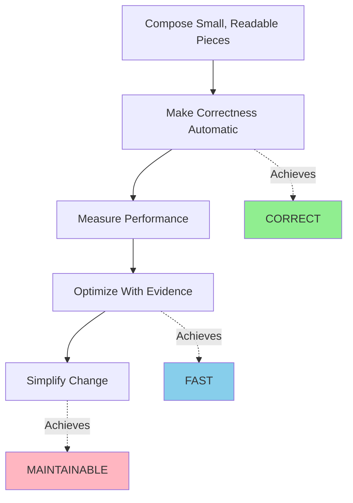

# My Coding Philosophy

Three Purposes I have when I wrote code - 

**CORRECT** _Code works reliably under all conditions_  
**FAST** _Code performs efficiently at scale_  
**MAINTAINABLE** _Code evolves without degrading quality_

### Rule 1 - Compose Small, Readable Pieces [Foundation]
_Build with small, focused functions that do one thing well._
- Write functions with single responsibilities
- Use descriptive names that reveal intent
- Limit nesting to 2-3 levels
- Favor composition over inheritance
- Minimize coupling between modules
- Design for deletion—make components replaceable

### Rule 2 - Make Correctness Automatic [CORRECT]

Prevent bugs at compile-time, catch them immediately at runtime.

- Explicit static types > comments
- Make invalid states unrepresentable
- Validate inputs at boundaries / function shouldn't assume
- Fail fast and loudly / no silent failures
- Write clear error messages - what failed, why, how to fix
- Test edge cases - empty, null, extremes

### Rule 3 - Measure, Then Optimize [FAST]
_Profile before optimizing. Evidence beats intuition._

- Instrument critical paths with metrics
- Profile in production-like conditions
- Optimize real bottlenecks, not guesses
- Choose algorithms that minimize complexity
- Cache when profiling proves it helps
- Test under realistic load
- Benchmark before and after changes

### Rule 4 - Simplify Change [MAINTAINABLE]
_Code is read and modified 10x more than written._

- Use Doc Strings to Document *why* decisions were made 
- Keep configuration explicit and centralized
- Version APIs and interfaces
- Write tests that document expected behavior
- Maintain consistency within the project > Coder Preference

## The Process

